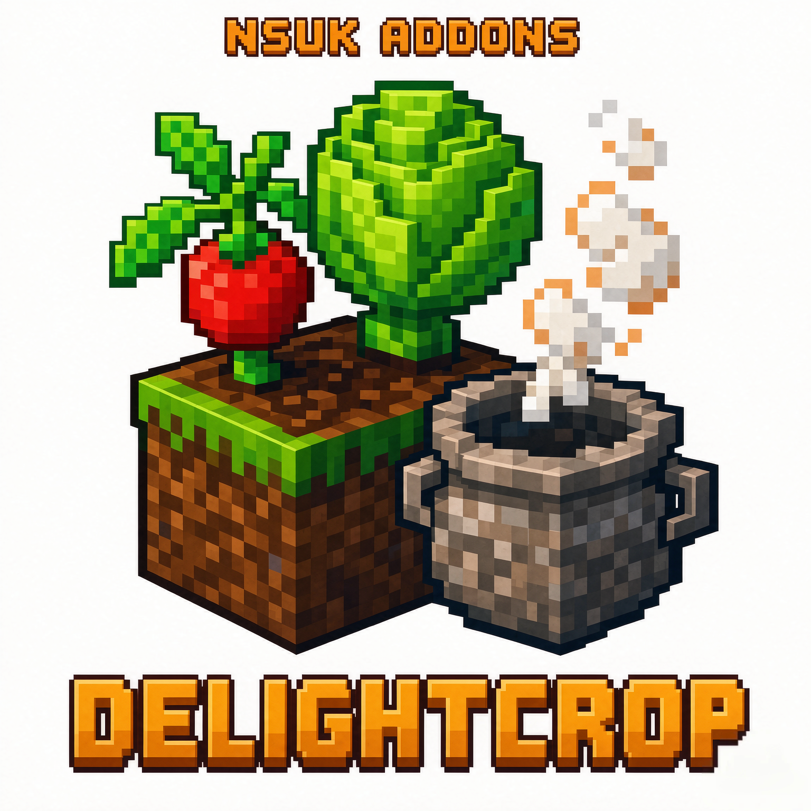

<p align="center">
  
</p>

<h1 align="center">NSUK：乐事作物附属</h1>

<p align="center">
  <b>NSUK: Delight Crop Addons</b><br/>
  让 <a href="https://github.com/New-Sim-U-Kraft/New-Simukraft-1.21.1">New:Sim-U-Kraft</a> 农田盒里的雇佣农民，种植乐事系列能种在耕地上的作物。
</p>

<p align="center">
  
  
  
  
  
</p>

<p align="center">
  <a href="#简介">简介</a> ·
  <a href="#功能">功能</a> ·
  <a href="#依赖">依赖</a> ·
  <a href="#安装">安装</a> ·
  <a href="#使用">使用</a> ·
  <a href="#为其它乐事模组添加作物">扩展</a> ·
  <a href="#构建">构建</a>
</p>

---

## 简介

雇佣农民打开农田盒之后，除了原版小麦、胡萝卜、马铃薯、甜菜，还可以选择已经加载的乐事作物。作业流程与原版小麦相同：挖水槽、耕地、播种、骨粉催熟、收割、补种。

只装本附属和 NSUK 时，农田盒仍只有原版作物，游戏可以正常启动。对应乐事模组装上后，作物会按来源分组出现在选择界面。

| 项目 | 内容 |
| --- | --- |
| 模组 ID | `nsukdelightcropaddons` |
| 游戏版本 | Minecraft **1.21.1** |
| 加载器 | NeoForge **21.1.x**（官方 Maven 目前到 21.1.249；启动器显示 21.1.428 时同样可以加载） |
| 必装 | [New:Sim-U-Kraft](https://github.com/New-Sim-U-Kraft/New-Simukraft-1.21.1)（`simukraft`） |
| 语言 | 简体中文 / English |
| 协议 | [GNU GPL 3.0](LICENSE) |
| 作者 | XiaoLiang小亮 & 安沐尘 |

## 功能

- 农田盒作物列表按乐事模组分组，支持中英文搜索
- 农民从农田盒旁边的箱子取种子，按小麦流程作业
- 番茄会把成熟藤蔓一并收获；玉米、香茅等高两格耕地作物同样收录
- 模组菜单里可以开关每个乐事来源，也可以手动新增自定义作物
- 数据包 JSON 即可接入其它乐事模组，不必改 Java
- 开启自动发现后，会扫描已加载模组里「种子 → 耕地 `CropBlock`」的组合

## 依赖

### 必装

- Minecraft 1.21.1
- NeoForge **21.1.x**
- New:Sim-U-Kraft（`simukraft`）

### 选装

装了才会出现对应作物。版本号为开发时验证过的组合，其它相近版本通常也可以。

| 模组 | Mod ID | 验证版本 | 耕地作物示例 |
| --- | --- | --- | --- |
| 农夫乐事 Farmer's Delight | `farmersdelight` | `1.21.1-1.3.4` | 卷心菜、番茄、洋葱 |
| 饺子乐事 Dumplings Delight | `dumplings_delight` | `1.21.1-1.4.1` | 白菜、蒜、葱、茴香、芹菜 |
| 凤梨乐事 Pineapple Delight | `pineapple_delight` | `1.2.0-1.21.1-neoforge` | 凤梨 |
| 香芋乐事 Ube's Delight | `ubesdelight` | `neoforge-1.21.1-0.4.14` | 紫芋、蒜、姜、香茅 |
| 蔬菜乐事 Veggies Delight | `veggiesdelight` | `1.21.1-1.9.3` | 甜椒、西兰花、花椰菜、蒜、红薯、芜菁、西葫芦 |
| 玉米乐事 Corn Delight | `corn_delight` | `1.2.10-1.21.1` | 玉米 |
| 扩充乐事 Expanded Delight | `expandeddelight` | `0.1.4` | 芦笋、红薯、辣椒、花生 |
| 多元乐事 Cultural Delights | `culturaldelights` | `0.17.8` | 黄瓜、茄子、白茄子、玉米 |
| 作物盛景 Croptopia | `croptopia` | `neoforge-1.21.1-4.2.4` | 大量耕地作物（番茄、玉米、咖啡、茶叶等） |
| 赣味乐事 Gan Delight Reborn | `gan_delight_reborn` | `2.3.04-neoforge-1.21.1` | 大豆、辣椒、姜、蒜、红薯、黄瓜等 |
| 樱途旅事 Trail & Tales Delight | `trailandtales_delight` | — | 灯笼果 |
| 千古乐事 Immortalers Delight | `immortalers_delight` | — | 古苜蓿、白垩玉黍、瓦斯麦、诡怨桂、既望莲 |
| 幻想乡乐事 Youkais' Feasts | `youkaisfeasts` | — | 黄豆、黄瓜、幻昙华 |
| 乡村乐事 Rustic Delight | `rusticdelight` | — | 棉花、咖啡、甜椒 |

作物定义在 [`src/main/resources/data/nsukdelightcropaddons/nsuk_crops/`](src/main/resources/data/nsukdelightcropaddons/nsuk_crops/) 下，一份 JSON 对应一个乐事模组。

## 安装

1. 安装 Minecraft 1.21.1 与 NeoForge 21.1.x。
2. 把 **New:Sim-U-Kraft** 和本模组 jar 放进 `mods` 文件夹。
3. 按需放入上表中的乐事模组。
4. 产物文件名：`NSUKDelightCropAddons-<版本>-neoforge-1.21.1.jar`。

## 使用

1. 放置 NSUK **农田盒**，雇佣农民。
2. 在农田盒旁边紧贴一个**箱子**，放入对应种子。
3. 打开农田盒 → **选择作物**。乐事作物按模组分组，可用搜索框按中文或英文过滤。
4. 框选农田区域后开始作业。

游戏内模组菜单（Mods → NSUK：乐事作物附属 → Config）可以：

- 开关某个乐事来源
- 关闭自动发现
- 新增自定义作物（填写种子物品 ID，会出现在农田盒的「其他」分组）

### 收录范围

农民会处理能种在**原版耕地**上、成熟后在原位收获的作物。黄瓜、西葫芦、哈密瓜等如果是小麦式 `CropBlock`（成熟后直接掉落），会收录。玉米、香茅等高两格的耕地作物也会收录。

### 暂不收录

这些植物无法按农田盒的耕地流程作业：

- 农夫乐事水稻（水田）
- 西瓜 / 南瓜式藤蔓（会在旁边生成独立瓜块）
- 树木、树苗、仙人掌（例如鳄梨、肉桂、巨人柱）
- 睡莲式水生作物（例如扩充乐事蔓越莓）
- 下界乐事爆弹椒、末地乐事紫颂多肉等不能种在原版耕地上的作物

若这些模组以后加入真正的 `CropBlock` 耕地种子，开启自动发现后会自己出现。自动发现会跳过藤蔓结瓜、树叶、树苗和仙人掌。

## 为其它乐事模组添加作物

推荐只加一份数据包 JSON，不必改 Java。

复制 [`examples/other_delight.json`](examples/other_delight.json)，放到资源包或数据包的：

```text
data/nsukdelightcropaddons/nsuk_crops/<模组id>.json
```

示例：

```json
{
  "mod": "corn_delight",
  "prefix": "cd",
  "label": "source.nsukdelightcropaddons.corn_delight",
  "discover": true,
  "crops": [
    {
      "id": "corn",
      "seed": "corn_delight:corn_seeds"
    }
  ]
}
```

<details>
<summary>JSON 字段说明</summary>

| 字段 | 含义 |
| --- | --- |
| `mod` | 乐事模组 id，未加载则整份文件跳过 |
| `prefix` | 短前缀。农田盒网络包作物 id 最长 32 字符，目录 id 为 `prefix_id` |
| `discover` | 扫描该命名空间下「种子物品 → CropBlock」 |
| `seed` | 农民从箱子消耗的种子 |
| `plant` | 种下的方块；省略时用种子 `BlockItem` 对应方块 |
| `harvest_blocks` | 额外视为本作物的方块（例如番茄藤） |
| `layout` | `full` 满铺，`stem` 隔格（瓜类） |
| `produce` | 藤蔓作物的结果方块 |
| `waterlog` | 种植时写入 `waterlogged=true` |
| `allow_non_crop_block` | 允许非 `CropBlock`（例如多元乐事玉米，仍种在耕地上） |

</details>

Java 注册入口：`com.xiaolianganmuchen.nsukdelightcropaddons.api.DelightCropApi`。

## 构建

环境：

- JDK **21**
- 把 NSUK 编译产物放在 `../NSUK1211/build/classes/java/main`，或把 NSUK jar 放到 `libs/`

```bat
gradlew.bat build
```

产物位于 `build/libs/NSUKDelightCropAddons-<版本>-neoforge-1.21.1.jar`。

### 源码结构

```text
src/main/java/.../nsukdelightcropaddons/
├── api/        给其它模组的注册 API
├── client/     分组可滚动作物选择界面、模组设置界面
├── config/     按来源 / 作物开关、自定义作物存档
├── crop/       作物目录、解析、发现、收获逻辑
├── mixin/      接到 NSUK 农田枚举、存档、作业循环
└── nsuk/       农田盒附加字段访问
```

NSUK 的 `FarmCrop` 是枚举，没有官方扩展点。本模组在农民处理某个农田盒时设置 `CropContext`，再把 `FarmCrop` 的种子 / 方块 / 成熟判定转到目录里的定义。原版作物不受影响。

## 许可

本模组以 [GNU GPL 3.0](LICENSE) 发布，与 New:Sim-U-Kraft 保持一致。

`TEMPLATE_LICENSE.txt` 是 NeoForged MDK 模板文件的 MIT 声明，不是本模组协议。
